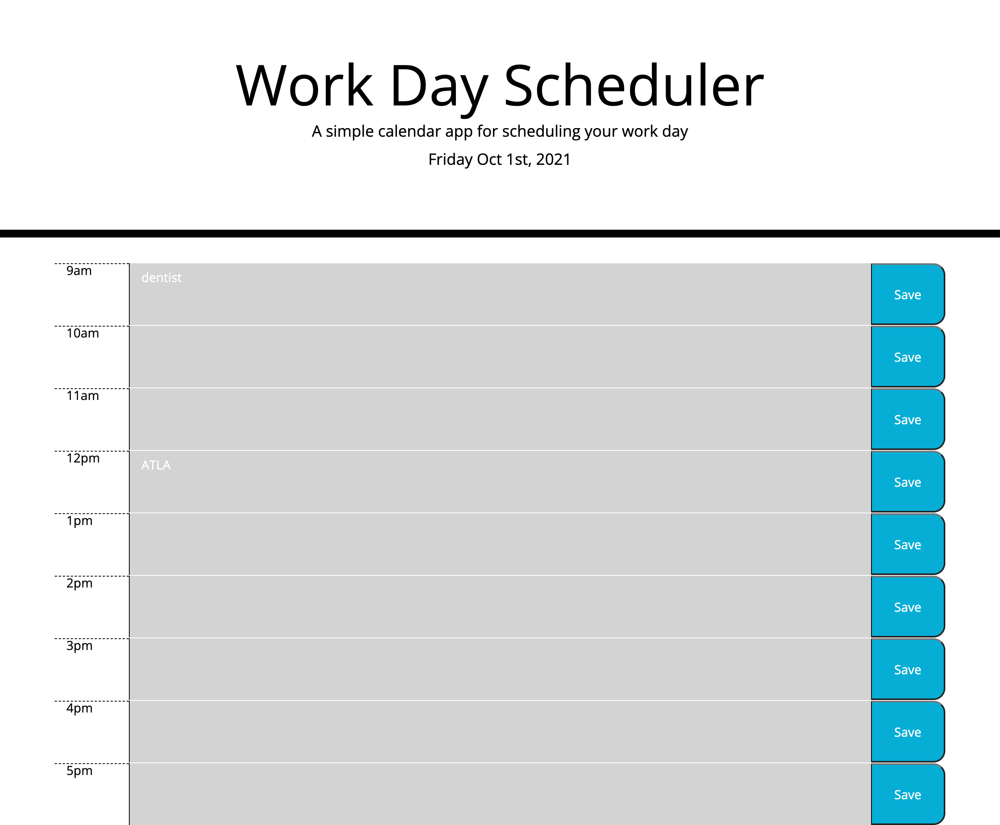

# Day Planner

## Day Planner Details For the Forgetful Busy Body
In this Day Planner you will be met with ease in storing all your ToDo's or appointments. With color coding time of day (past, present and future) Itll be easier to spot exactly whats on your planner! Future appointment at 5? Look for the row color coded with green! Was your show earlier that day? Look at the grey rows that indicate the past time! And Current time will be met with red!

## The Process 
Starting this project I was recommended to use a for loop. Unsure of exactly how to plug in my information, I saught another way. After discussing and planning with some classmates, I decided to make each row in HTML and put ID's in each as well. Doing this made it a litte easier to identify each time and put unique values in them. 

## Final touches
Afterall, I did need to use a for loop to plug in local storage for the save button. Which was easier for me right now since it only worries about one function, clicking and saving. 

## Follow the link to the Deployed Planner that is Screenshot below.
https://cortezstephanie.github.io/05HomeworkScheduler-SC/[GitHub](https://cortezstephanie.github.io/05HomeworkScheduler-SC/)

##### Thank you Ethan, Ismeny and Jayla for helping me with this project!
